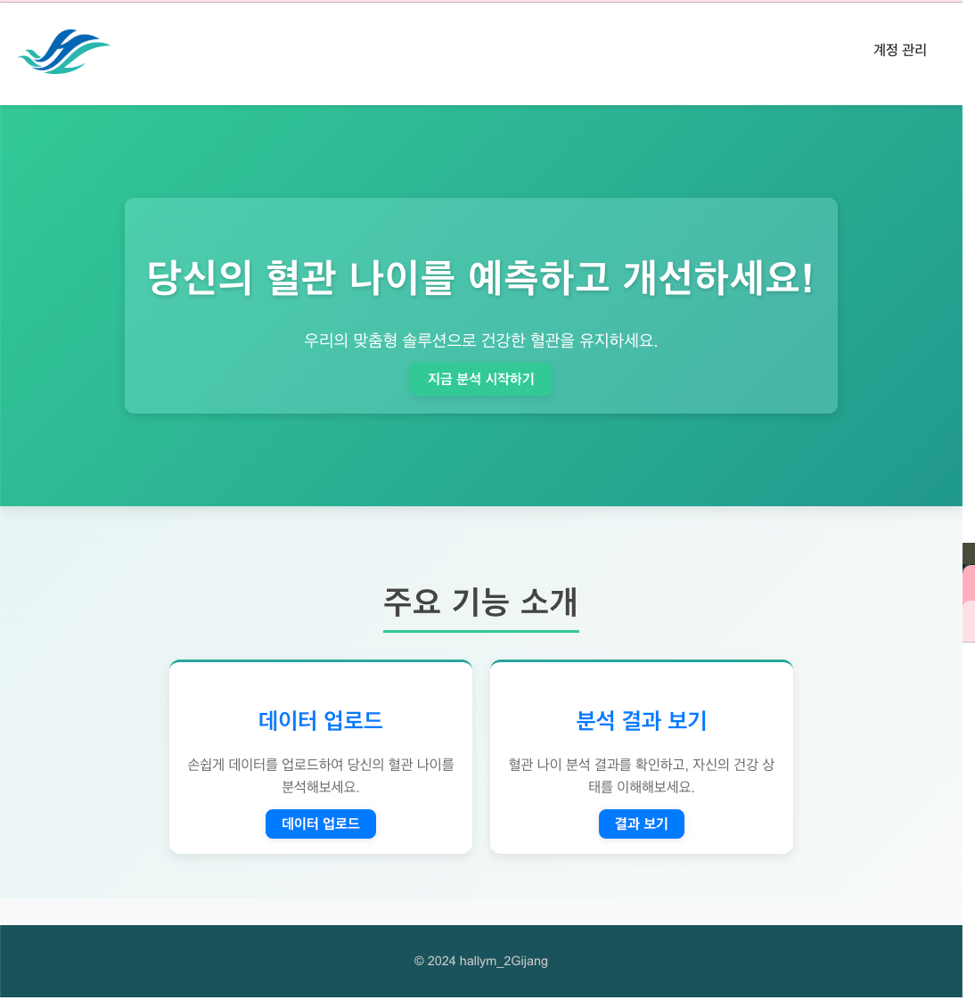

# 주제 : APG 데이터 분석 및 AI 모델을 통한 맞춤형 솔루션 제공 웹 개발 

## 개요 
APG 측정 데이터를 분석하여 LSTM 모델 등의 지도 학습 기법을 활용해 사용자의 혈관 나이를 예측하는 AI 모델을 개발하고, 이를 웹 기반 솔루션과 연동하여 사용자 맞춤형 정보를 제공하는 것입니다. 
개발된 AI 모델은 사용자가 측정 데이터를 웹에 업로드하면 예측된 혈관 나이와 함께 개인 맞춤형 솔루션을 제공하여, 사용자가 자신의 혈관 상태를 쉽게 파악하고 건강을 개선하기 위한 정보를 제공받을 수 있도록 합니다. 
이를 통해 개인의 혈관 나이를 예측하여 노화속도를 알 수 있으며 개인 맞춤형 솔루션으로 건강 관리에 도움을 주고자 합니다. 

## 기능
### 1. 회원가입 

- 원하는 아이디가 중복인지 아닌지 체크 후 패스워드를 입력하여 회원가입합니다.

### 2. 로그인

- 회원가입한 아이디와 패스워드로 로그인을 합니다.
    - 로그인 성공 시 홈페이지로 넘어갑니다.
### 3. 홈페이지

- **지금 분석 시작하기** 혹은 **데이터 업로드** 버튼을 클릭하여 업로드 페이지로 이동합니다.
### 4. 파일 업로드

- 혈관 나이 분석하고자 하는 사람의 **이름**을 입력 후 **데이터**를 추가해서 분석을 시작합니다.
### 5. 결과 확인

- 예측된 결과를 확인할 수 있는 결과 페이지입니다.
    - 결과로 **맥파 유형** 및 **솔루션**을 확인할 수 있습니다.
    - **APG 파형 그래프**에서는 **a,b,c,d,e**의 **피크 값**과 그에 대한 설명을 볼 수 있습니다.
